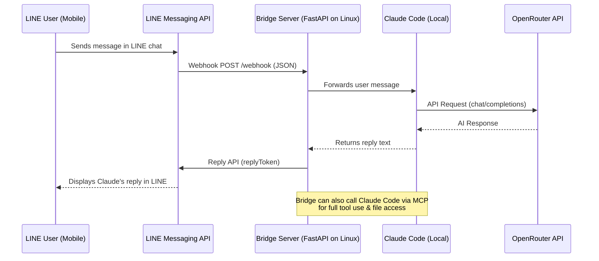
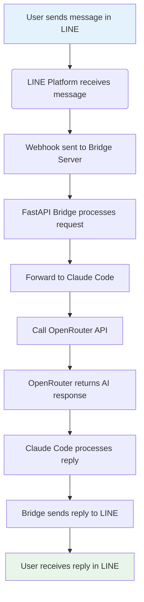

**Here's a clear Mermaid workflow diagram** showing how a message flows from the user to Claude and back.

```mermaid
sequenceDiagram
    participant User as LINE User (Mobile)
    participant LINE as LINE Messaging API
    participant Bridge as Bridge Server (FastAPI on Linux)
    participant Claude as Claude Code (Local)
    participant OpenRouter as OpenRouter API

    %% Message Flow
    User->>LINE: Sends message in LINE chat
    LINE->>Bridge: Webhook POST /webhook (JSON)
    Bridge->>Claude: Forwards user message
    Claude->>OpenRouter: API Request (chat/completions)
    OpenRouter-->>Claude: AI Response
    Claude-->>Bridge: Returns reply text
    Bridge->>LINE: Reply API (replyToken)
    LINE-->>User: Displays Claude's reply in LINE

    %% Note
    Note over Bridge,Claude: Bridge can also call Claude Code via MCP<br/>for full tool use & file access
```

---

### Alternative: **Flowchart Version** (Simpler Overview)

```mermaid
flowchart TD
    A[User sends message in LINE] 
    --> B(LINE Platform receives message)
    --> C[Webhook sent to Bridge Server]
    --> D[FastAPI Bridge processes request]
    
    D --> E[Forward to Claude Code]
    E --> F[Call OpenRouter API]
    F --> G[OpenRouter returns AI response]
    
    G --> H[Claude Code processes reply]
    H --> I[Bridge sends reply to LINE]
    I --> J[User receives reply in LINE]

    style A fill:#e3f2fd
    style J fill:#e8f5e9
```
